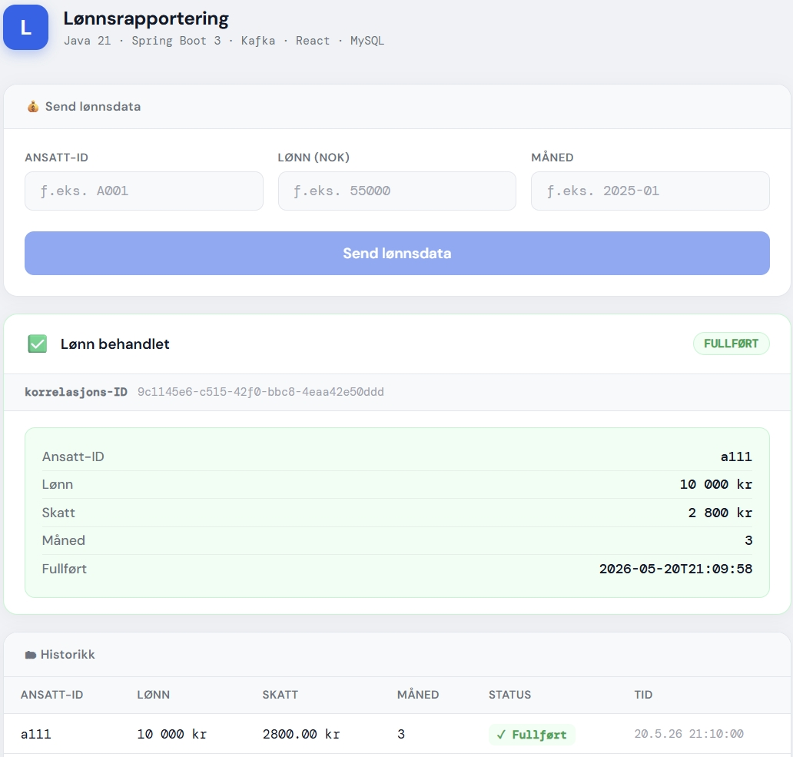

# Lønnsrapportering – Hendelsesdrevet lønnsrapporteringssystem (Java + Spring Boot + Kafka + MySQL + Camunda)

> Hendelsesdrevet system for lønnsrapportering, automatisk skatteberegning og AI-støttet feildiagnostikk,
> bygget med Java 21, Spring Boot 3, Apache Kafka, MySQL og Camunda BPM.

---

## 🎥 Demo

### 🎬 Payroll - Klikk på bildet nedenfor for å se hele demoen på YouTube ▶️

[](https://www.youtube.com/watch?v=gF_LzKdxD3g&list=PLOwWtF7kBLb923hDu7gTfCGCdn5vc-KjL)<br>
NB! Stemmen i videoen er generert med AI-basert tekst-til-tale-teknologi.

## Oversikt

Et hendelsesdrevet backend-system som håndterer lønnsrapportering asynkront via Kafka.
Systemet mottar lønnsmeldinger via REST API, lagrer dem først i MySQL, publiserer events til Kafka,
og sender automatisk logg- og feilhendelser til LogSenseAI for AI-basert analyse og audit logging.

Systemet er designet med fokus på:

* Løst koblet arkitektur via Kafka for asynkron meldingshåndtering
* Tydelig separasjon mellom API-lag, service, producer og consumer
* DTO-basert API-grense — entiteter eksponeres aldri direkte
* Persistens med statussporing (`PENDING → COMPLETED / FAILED`) i MySQL
* Persistens før event-publisering for trygg meldingsflyt
* CorrelationId-basert sporing gjennom hele systemet
* Automatisk logg- og feilrapportering til LogSenseAI via Kafka
* React-frontend med statusvisning og direktelenke til LogSenseAI ved feil
* BPMN-basert prosessorkestrasjon via Camunda

---

## Arkitektur

```text
Client / React (port 3001)
        ↓
REST API (Spring Boot)
        ↓
PayrollController
        ↓
PayrollService
    ├── validate()
    ├── save PENDING → MySQL (payrolldb)
    ├── publish PayrollEvent → Kafka (payroll-events)
    └── publish LogEvent → Kafka (payroll-log-events)
                    ↓
            ┌────── Kafka Cluster ──────┐
            │                           │
            ↓                           ↓
   payroll-events              payroll-log-events
            ↓                           ↓
   PayrollConsumer             LogSenseAI Consumer
            ↓                           ↓
   Camunda BPM Process       AI AgentService (Llama3.2)
            ↓                           ↓
   CalculateTaxDelegate      Save AI result → PostgreSQL
            ↓                           ↓
   SaveCompletedDelegate       AI Analysis Result
            ↓                           ↓
       Update MySQL                 WebSocket
            ↓                           ↓
        COMPLETED          React Dashboard (Realtime UI)
```

---

## Integrasjon med LogSenseAI

Systemet sender automatisk log events til LogSenseAI via Kafka topic `payroll-log-events`:

| Event         | Nivå    | Når                        |
|---------------|---------|----------------------------|
| Lønn godkjent | `INFO`  | Vellykket innsendt         |
| Ugyldig data  | `WARN`  | Validering feilet          |
| Uventet feil  | `ERROR` | Exception under behandling |

`INFO`-events ignoreres av LogSenseAI. `WARN` og `ERROR` analyseres automatisk av AI.

```
payroll ERROR
      ↓
PayrollService → topic: payroll-log-events
      ↓
LogSenseAI consumer
      ↓
AgentService → LLM analyserer rotårsak
      ↓
Resultat lagres i PostgreSQL (LogSenseAI DB)
      ↓
WebSocket → React Dashboard (Realtime UI)
```

---

## Teknologistabel

| Lag                 | Teknologi                      |
|---------------------|--------------------------------|
| Språk               | Java 21                        |
| Backend-rammeverk   | Spring Boot 3, Spring Web      |
| Frontend            | React (Create React App)       |
| Meldingssystem      | Apache Kafka + Zookeeper       |
| Database            | MySQL 8 + Spring Data JPA      |
| Prosessorkestrasjon | Camunda BPM 7                  |
| Serialisering       | Jackson (StringSerializer)     |
| API-dokumentasjon   | Swagger UI (SpringDoc OpenAPI) |
| Infrastruktur       | Docker + Docker Compose        |

---

## Nøkkelfunksjoner

### Hendelsesdrevet lønnsrapportering med persistens

`PayrollService` validerer innkommende `PayrollRequest` DTO,
mapper den til en `PayrollRecord`-entitet,
lagrer i MySQL med status `PENDING`,
publiserer deretter `PayrollEvent` til Kafka,
og oppdaterer til `COMPLETED` eller `FAILED` etter behandling.

### Statuslivssyklus

```text
PENDING → COMPLETED
        → FAILED
```

### CorrelationId-basert sporing

Hver lønnsinnmelding tildeles en unik `correlationId` (UUID) av servicelaget.

CorrelationId brukes gjennom hele flyten:

* REST API
* Database
* Kafka Producer
* Kafka Consumer
* Camunda Process
* LogSenseAI
* Frontend

Dette gjør hele behandlingskjeden sporbar.

---

### Asynkron behandling

Payroll-data behandles asynkront av `PayrollConsumer`
etter at eventet er publisert til Kafka.

`PayrollConsumer` starter en Camunda BPMN-prosess (`payroll-process`)
som orkestrerer behandlingen via `CalculateTaxDelegate` og `SaveCompletedDelegate`.

```
PayrollConsumer
      ↓
Camunda: payroll-process
      ↓
CalculateTaxDelegate → beregner skatt (lønn × 0.28)
      ↓
SaveCompletedDelegate → lagrer COMPLETED i MySQL
```

---

### AI-støttet feildiagnostikk

Ved feil sendes et `LogEvent` til Kafka topic `payroll-log-events`.

LogSenseAI konsumerer eventet og utfører:

* AI-basert rotårsaksanalyse
* audit logging
* observability
* feildiagnostikk
* hendelsessporing

---

### React-frontend med statusvisning

Frontend-applikasjonen:

* sender lønnsmeldinger
* poller status via correlationId
* viser:

    * `PENDING`
    * `COMPLETED`
    * `FAILED`
* viser lenke til LogSenseAI ved feil
* viser historikk over tidligere innsendelser

---

## Datamodell

### PayrollRecord

| Felt          | Type       | Beskrivelse                            |
|---------------|------------|----------------------------------------|
| id            | Long       | Auto-generert primærnøkkel             |
| correlationId | String     | UUID for sporing gjennom hele systemet |
| employeeId    | String     | Unik identifikator for ansatt          |
| salary        | BigDecimal | Bruttolønn for perioden                |
| month         | String     | Rapporteringsmåned (f.eks. "2025-01")  |
| tax           | BigDecimal | Beregnet skatt (lønn × 0.28)           |
| status        | Enum       | PENDING / COMPLETED / FAILED           |
| createdAt     | DateTime   | Tidspunkt for opprettelse              |
| completedAt   | DateTime   | Tidspunkt for fullføring eller feil    |

---

## Kafka Topics

| Topic              | Beskrivelse                         |
|--------------------|-------------------------------------|
| payroll-events     | Payroll domain events               |
| payroll-log-events | Audit- og feillogger til LogSenseAI |

---

## API-referanse

### Send lønnsmelding

```http
POST /api/v1/payroll
Content-Type: application/json
```

**Forespørselskropp:**

```json
{
  "employeeId": "E001",
  "salary": 50000.00,
  "month": "2025-01"
}
```

**Svar — 202 Accepted:**

```json
{
  "correlationId": "b3f1c2d4-...",
  "status": "PENDING"
}
```

---

### Hent behandlingsresultat

```http
GET /api/v1/payroll/{correlationId}
```

**Svar — 200 OK:**

```json
{
  "correlationId": "b3f1c2d4-...",
  "employeeId": "E001",
  "salary": 50000.00,
  "month": "2025-01",
  "status": "COMPLETED",
  "createdAt": "2026-01-01T12:00:00",
  "completedAt": "2026-01-01T12:00:01"
}
```

**Eksempel med curl:**

```bash
curl -X POST http://localhost:8282/api/v1/payroll \
  -H "Content-Type: application/json" \
  -d '{"employeeId":"E001","salary":50000.00,"month":"2025-01"}'
```

---

## Prosjektstruktur

```
backend/
│
├── config/
│   ├── KafkaConfig.java                   # Kafka topic-definisjoner
│   ├── KafkaConfigLoader.java             # Aktiverer binding av Kafka-properties
│   ├── KafkaProperties.java               # Kafka topic- og consumer-properties
│   ├── SecurityConfig.java                # Spring Security + CORS
│   ├── SwaggerConfig.java                 # OpenAPI / Swagger UI
│   └── WebConfig.java                     # CORS-konfigurasjonskilden
│
├── controller/
│   └── PayrollController.java             # POST /api/v1/payroll + GET /{correlationId}
│
├── delegate/
│   ├── CalculateTaxDelegate.java          # Camunda delegate: beregner skatt
│   └── SaveCompletedDelegate.java         # Camunda delegate: lagrer COMPLETED i MySQL
│
├── dto/
│   ├── PayrollRequest.java                # Innkommende API-forespørsel (employeeId, salary, month)
│   └── PayrollResponse.java               # Utgående API-svar (correlationId, status, osv.)
│
├── exception/
│   └── PayrollSerializationException.java # Kastes ved Kafka-serialiseringsfeil
│
├── model/
│   └── PayrollRecord.java                 # @Entity: correlationId, salary, tax, status, timestamps
│
├── repository/
│   └── PayrollRepository.java             # findByCorrelationId
│
├── service/
│   ├── PayrollService.java                # Valider → map DTO → lagre → publiser Kafka-event
│   ├── PayrollProducer.java               # Serialiserer og sender til payroll-events topic
│   └── PayrollConsumer.java               # @KafkaListener → starter Camunda-prosess
│
└── Application.java                       # Spring Boot-applikasjonens startpunkt

resources/
├── application.yml                        # Delte innstillinger (alle miljøer)
├── application-k8s.yml                    # Kubernetes-konfigurasjon
├── application-local.yml                  # Lokal utvikling (ikke committet til Git)
└── payroll-process.bpmn                   # Camunda BPMN-prosessdefinisjon

frontend/
└── src/
    ├── App.js                             # Skjema, statusvisning, LogSenseAI-knapp, historikk
    ├── App.css                            # Styling
    └── config.js                          # API_URL, LOGSENSE_URL, POLL_INTERVAL, POLL_MAX
```

---

## Konfigurasjon

All konfigurasjon er eksternalisert i `application.yml`:

| Egenskap                 | Verdi                   |
|--------------------------|-------------------------|
| Server port              | `8282`                  |
| Kafka bootstrap          | `localhost:9092`        |
| Kafka topic (lønn)       | `payroll-events`        |
| Kafka topic (logg)       | `payroll-log-events`    |
| Consumer group           | `payroll-group`         |
| MySQL database           | `payrolldb`             |
| MySQL port               | `3306`                  |
| API base path            | `/api/v1/payroll`       |
| CORS tillatt opprinnelse | `http://localhost:3001` |

---

## Kom i gang

### Forutsetninger

- Java 21+
- Node.js 18+
- Docker og Docker Compose

### 1. Start infrastruktur

```bash
# Fra LogSenseAI-mappen (deler docker-compose med LogSenseAI)
docker-compose up -d
```

Starter PostgreSQL (LogSenseAI), MySQL (lønn), Kafka og Zookeeper.

### 2. Kjør backend

```bash
./mvnw spring-boot:run

```

Aktiver profil i IntelliJ:

```
Run Configuration → Environment variables → SPRING_PROFILES_ACTIVE=local
```

`application-local.yml` skal ikke committes til Git (ligger i `.gitignore`)

API tilgjengelig på `http://localhost:8282`  
Swagger UI på `http://localhost:8282/swagger-ui.html`

### 3. Kjør frontend

```bash
cd frontend
npm install
npm start
```

React-appen tilgjengelig på `http://localhost:3001`

---

## Relasjon til LogSenseAI

Begge systemer deler Kafka-broker, men opererer uavhengig:

|                | lønnsrapportering                      | LogSenseAI                       |
|----------------|----------------------------------------|----------------------------------|
| Port           | `8282`                                 | `8080`                           |
| Frontend       | `3001`                                 | `3000`                           |
| Kafka topics   | `payroll-events`, `payroll-log-events` | `log-topic`                      |
| Consumer group | `payroll-group`                        | `log-group`, `logai-loenn-group` |
| Database       | MySQL (`payrolldb`)                    | PostgreSQL (`logdb`)             |
| AI-integrasjon | Sender events                          | Analyserer events                |

---

## Veikart

* [x] Persistens med MySQL
* [x] Statussporing (`PENDING → COMPLETED / FAILED`)
* [x] CorrelationId-sporing
* [x] DTO-basert API-lag
* [x] Kafka producer/consumer-flow
* [x] Automatisk logg- og feilrapportering
* [x] Integrasjon med LogSenseAI
* [x] React-frontend med polling
* [x] Eksternalisert konfigurasjon via `application.yml`
* [x] BPMN-basert prosessorkestrasjon via Camunda
* [ ] Retry / Dead Letter Queue
* [ ] OAuth2 / JWT security
* [ ] Metrics og observability
* [ ] Kafka Schema Registry
* [ ] Integration tests med Testcontainers

---

## Om

Utviklet som et læringsprosjekt innen:

* hendelsesdrevet arkitektur
* Spring Boot
* Apache Kafka
* distribuerte systemer
* producer/consumer-pattern
* asynkron backend-prosessering
* BPMN-basert prosessorkestrasjon med Camunda
* AI-basert observability og feildiagnostikk via LogSenseAI
